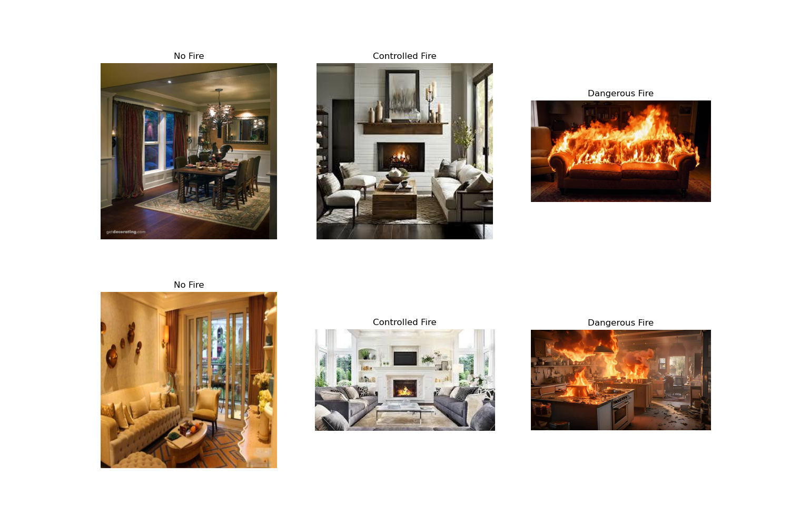
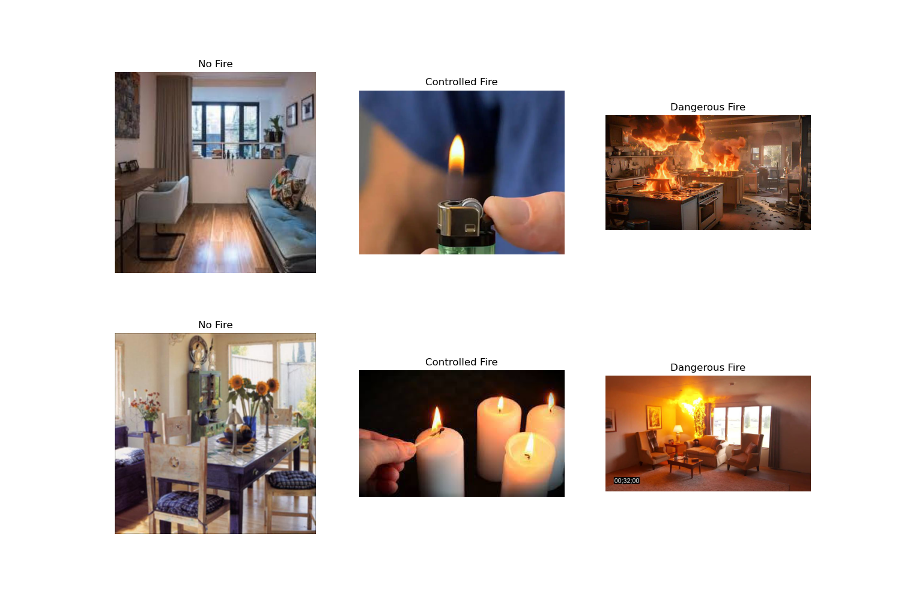

# fire-context-aware-dataset
A dataset created for surveying/training Visual Language Models (VLM) to understand fire and its contextual environment. The dataset categorizes images into three classes: no fire, dangerous fire, and controlled fire.

## Dataset Structure

```
fire-context-aware-dataset/
├── original_dataset/
│   ├── image1.jpg
│   ├── image2.jpg
│   └── ...
└── labels.csv
```

## Labels Format

The `labels.csv` file contains three columns:
- `image_path`: Path to the image file
- `label`: Classification label (no fire/dangerous fire/controlled fire)
- `caption`: Detailed description of the image scene

Example:
```csv
image_path,label,caption
original_dataset/image1.jpg,no fire,"The image shows a cozy living room with a fireplace, a potted plant, a lamp, and a painting on the wall. The room appears to be well-lit and decorated."
original_dataset/image37.jpg,controlled fire,"The image shows a cozy dining room with a lit fireplace, wooden chairs around a table set for a meal, and a chandelier hanging from the ceiling. The room has a warm ambiance with candles and decorative elements."
original_dataset/image1025.jpg,dangerous fire,"The image shows a kitchen with flames coming from the oven and microwave, indicating a dangerous fire situation."
```



